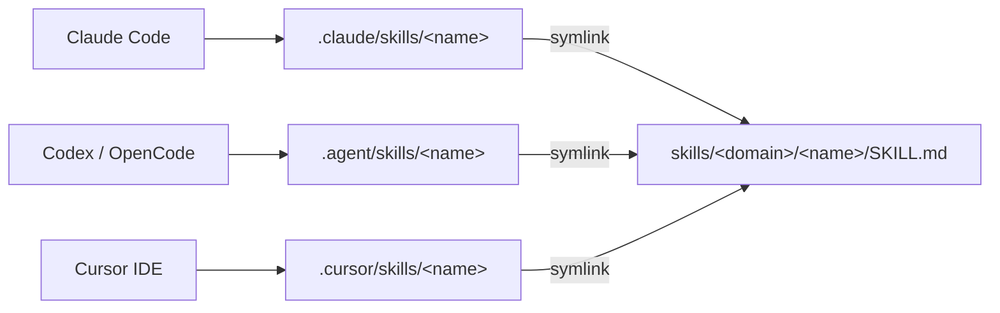

# SKILLS

> Bazinga 的个人 AI Agent 技能仓库。一份源、按 domain 分层、Claude Code / Codex / Cursor 都能直接用。

把日常用得顺手的工作流沉淀成可复用的 [Anthropic Skill](https://docs.claude.com/en/docs/claude-code/skills)。每个 skill 是一个独立目录，含一份 `SKILL.md` 和可选的 `references/` `scripts/` `assets/`。仓库内部维护好三套扁平 symlink，clone 下来即可被三种主流 agent 自动发现，不依赖任何额外 CLI。

## Layout

```
SKILLS/
├── README.md
├── AGENTS.md                                   # 给通用 agent 的根级入口
├── LICENSE
├── skills/                                     # 唯一的 skill 源目录
│   └── <domain>/
│       └── <skill-name>/
│           ├── SKILL.md                        # 必需，含 frontmatter
│           ├── references/                     # 可选：长文档、清单、提示词模板
│           ├── scripts/                        # 可选：辅助脚本
│           └── assets/                         # 可选：图片、字体等静态资源
├── templates/                                  # 新 skill 骨架，非 skill 区
│   └── SKILL.template.md
├── .claude/skills/<name> -> ../../skills/<domain>/<name>      # Claude Code 入口
├── .agent/skills/<name>  -> ../../skills/<domain>/<name>      # Codex / OpenCode 等入口
└── .cursor/skills/<name> -> ../../skills/<domain>/<name>      # Cursor 仓库级入口
```

> 注意：agent 目录下只能用**扁平 symlink**（一层 `<agent>/skills/<skill-name>` 直链到具体 skill），不要 symlink 整个 `skills/` 顶层——多数 agent 不会递归扫描 domain 子目录。

## Current Skills

| Domain  | Skill | When to use | What it does |
|---------|-------|-------------|--------------|
| content | [reverse-engineer-image-style](skills/content/reverse-engineer-image-style/SKILL.md) | 用户给参考图，想要**可复用的提示词**，并能在换主体后保留风格 | 用 L1-L4 解耦模型把"风格"和"主体"分离，4 步走完观察 → 指纹 → 适配 → 出 prompt，输出针对 ChatGPT / Claude / Gemini 等对话式 LLM 的自然语言提示词 |

## Conventions

- 目录名与 `frontmatter.name` 都用小写 kebab-case，**保持一致**。
- 一个 skill 一个目录，即使首版只有一份 `SKILL.md`。
- `frontmatter` 必填 `name` 和 `description`；`description` 必须明确触发条件（"Use when ..."），这是 agent 自动调用的依据。
- 不要把 token / 密钥 / 机器特定路径写进 SKILL 文件。
- `templates/` 目录里的文件**不是 skill**，仅作骨架，agent 不应加载。
- 域（domain）只是稳定分类桶，不要拿临时项目名当 domain。

## Domains

参考 Innei/SKILL 的分类约定，五个稳定 domain 已经够用：

| Domain         | 适合放什么 |
|----------------|-----------|
| infrastructure | 部署、服务器、数据库、容器、可观测性 |
| automation     | 重复 shell / CLI 工作流、运维 playbook |
| writing        | 结构化写作、出版编辑流程 |
| research       | 调研方法、信息源采集、分析框架 |
| content        | 内容生产、媒体处理、站点专属发布操作 |

## Agent Integration

仓库已内置三套扁平 symlink，三种主流 agent 都能直接识别同一份 skill 源：

| Agent | 仓库内入口（已内置） | 用户级生效路径 |
|-------|------------------|--------------|
| Claude Code | `.claude/skills/<name>` | `~/.claude/skills/<name>` |
| Codex / OpenCode 等读 `~/.agent` 的通用 agent | `.agent/skills/<name>` | `~/.agent/skills/<name>` |
| Cursor | `.cursor/skills/<name>`（仓库级）| `~/.cursor/skills-cursor/<name>`（确定生效） |

> 关于 Cursor：用户级路径 `~/.cursor/skills-cursor/<name>/SKILL.md` 是确定生效的；仓库级 `.cursor/skills/` 是否在所有 Cursor 版本中被自动加载，建议自己跑一次确认。如果 Cursor 没识别，用下方"批量装到用户级"脚本的 Cursor 段兜底。

### 批量装到用户级（可选，在仓库根目录执行）

下面的脚本会把仓库内**所有** skill 一次性 symlink 到对应 agent 的用户级目录。按需复制对应几段：

```bash
# Claude Code
mkdir -p ~/.claude/skills
for d in skills/*/*/; do
  ln -sfn "$(pwd)/$d" ~/.claude/skills/"$(basename "$d")"
done

# Codex / OpenCode 等读 ~/.agent/skills/ 的工具
mkdir -p ~/.agent/skills
for d in skills/*/*/; do
  ln -sfn "$(pwd)/$d" ~/.agent/skills/"$(basename "$d")"
done

# Cursor 用户级（确定生效）
mkdir -p ~/.cursor/skills-cursor
for d in skills/*/*/; do
  ln -sfn "$(pwd)/$d" ~/.cursor/skills-cursor/"$(basename "$d")"
done
```

> `ln -sfn` 是幂等的：已存在的同名 symlink 会被刷新而不是报错，所以这段脚本可以反复跑。



## Adding a New Skill

在仓库根目录执行（**先把开头两行的 `DOMAIN` 和 `NAME` 改成你自己的**）：

```bash
DOMAIN=content              # 选一个 domain：infrastructure / automation / writing / research / content
NAME=my-new-skill           # skill 名（小写 kebab-case）

# 1. 创建 skill 目录并从模板拷一份 SKILL.md
mkdir -p "skills/$DOMAIN/$NAME"
cp templates/SKILL.template.md "skills/$DOMAIN/$NAME/SKILL.md"

# 2. 编辑 frontmatter（name + description）和正文
# 3. （可选）按需添加 references/ scripts/ assets/

# 4. 在三个 agent 入口建扁平 symlink
for AGENT in .claude .agent .cursor; do
  ln -s "../../skills/$DOMAIN/$NAME" "$AGENT/skills/$NAME"
done
```

或者一条命令跑完目录与 symlink（前两行改完，整段拷贝执行）：

```bash
DOMAIN=content NAME=my-new-skill && \
  mkdir -p "skills/$DOMAIN/$NAME" && \
  cp templates/SKILL.template.md "skills/$DOMAIN/$NAME/SKILL.md" && \
  for AGENT in .claude .agent .cursor; do \
    ln -s "../../skills/$DOMAIN/$NAME" "$AGENT/skills/$NAME"; \
  done
```

## Naming Guidance

- 目录名小写 kebab-case，保持稳定（其他人可能 import / symlink 你的 skill）。
- 名字尽量"目标 + 动作"，例如 `reverse-engineer-image-style`、`mx-space-remote-db-access`，避免 `helper`、`utils` 这类无信息名。

## Acknowledgements

这个仓库的结构和文档写法重度借鉴了三个优秀的 skill 仓库，感谢作者们把规范打磨得这么清晰：

- [Innei/SKILL](https://github.com/Innei/SKILL) — 目录分层（`skills/<domain>/<skill-name>/`）、扁平 symlink 适配多 agent 的方案、Conventions / Adding a New Skill 段落组织。
- [tw93/Waza](https://github.com/tw93/Waza) — Skills 总览表 "When + What it does" 两列写法、README 的叙事节奏、Skill 链式调用的思路。
- [tw93/Kami](https://github.com/tw93/Kami) — 单 skill 内部 "Why / 适用场景 / 示例触发语" 的写法风格。

如果你也想搞自己的 skill 仓库，强烈推荐先去看一遍这三个 repo。

## License

MIT，见 [LICENSE](LICENSE)。
